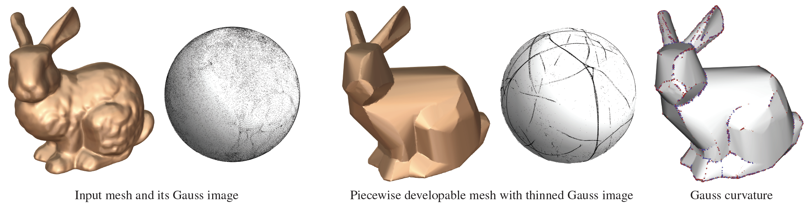

<!---
{}
Click the *Cite* button above to demo the feature to enable visitors to import publication metadata into their reference management software.
{}

{}
Create your slides in Markdown - click the *Slides* button to check out the example.
{}

Supplementary notes can be added here, including [code, math, and images](https://wowchemy.com/docs/writing-markdown-latex/).
--->

## Video

<iframe width="600" height="400"
src="https://www.youtube.com/embed/watch?v=k0RVs_FKYd4&list=PLUykN3u3Z3NUz9kNy-d9bVOrZQVz0T8Yb">
</iframe>

## Animation

