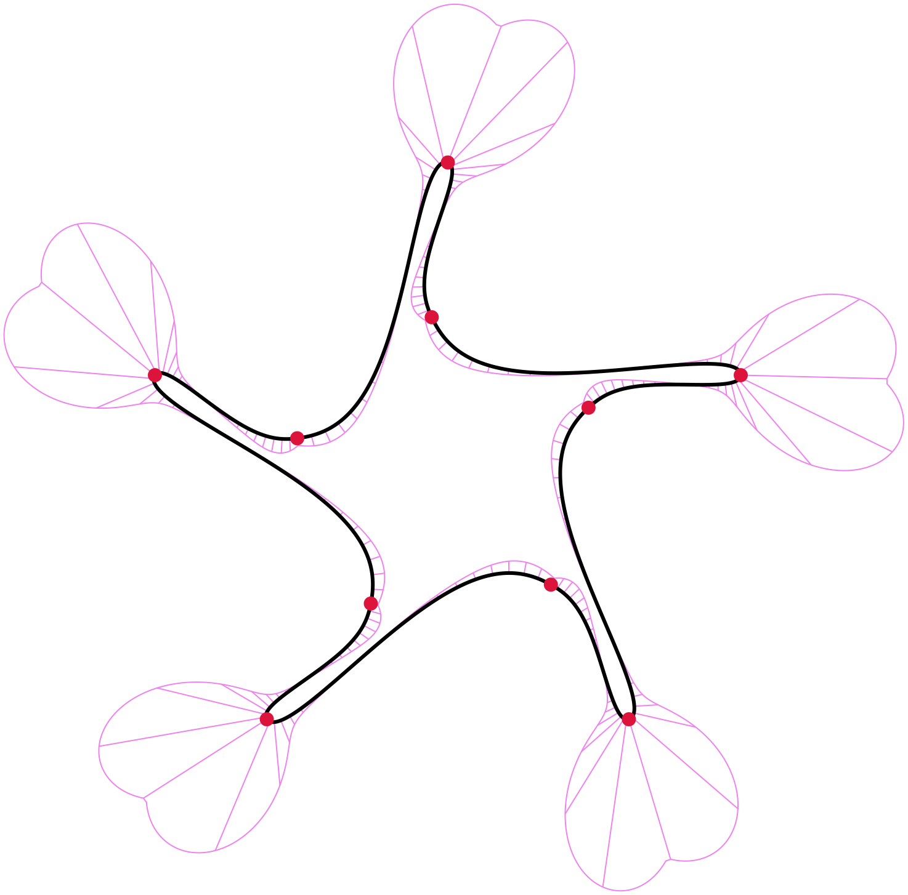
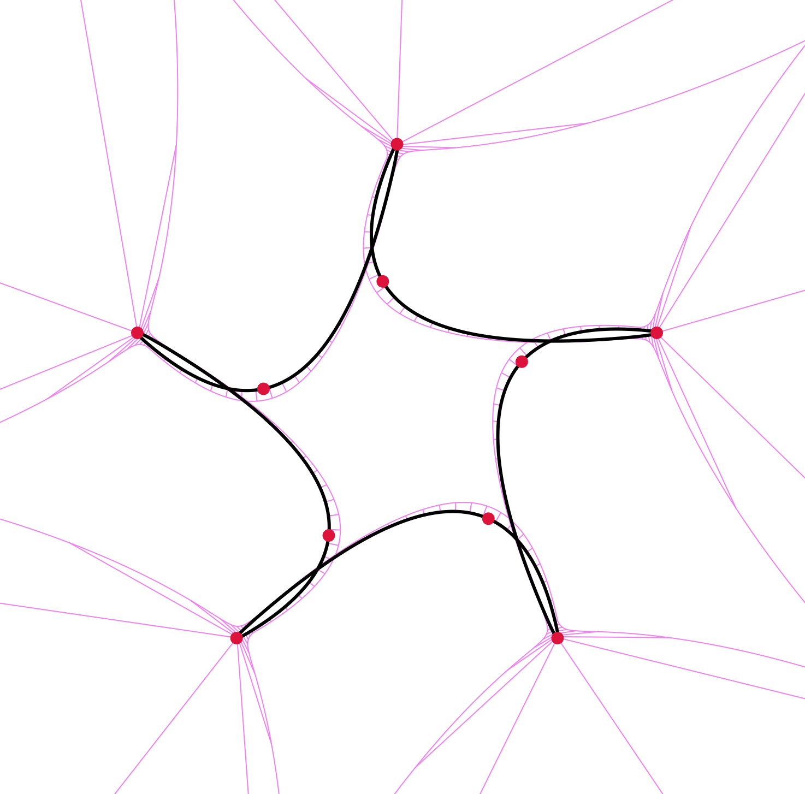
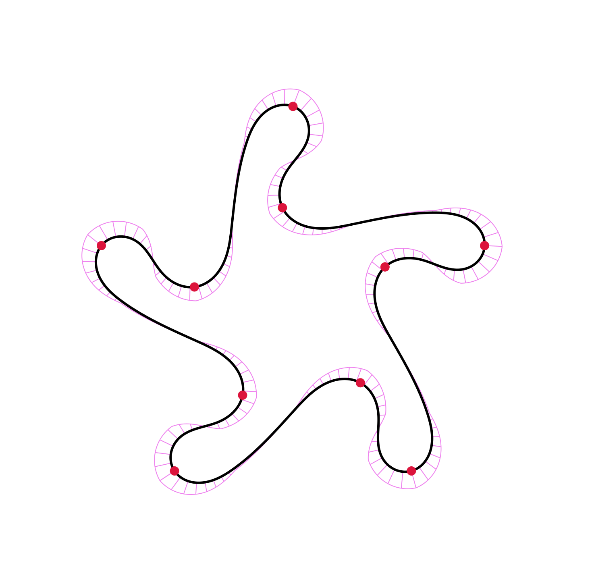
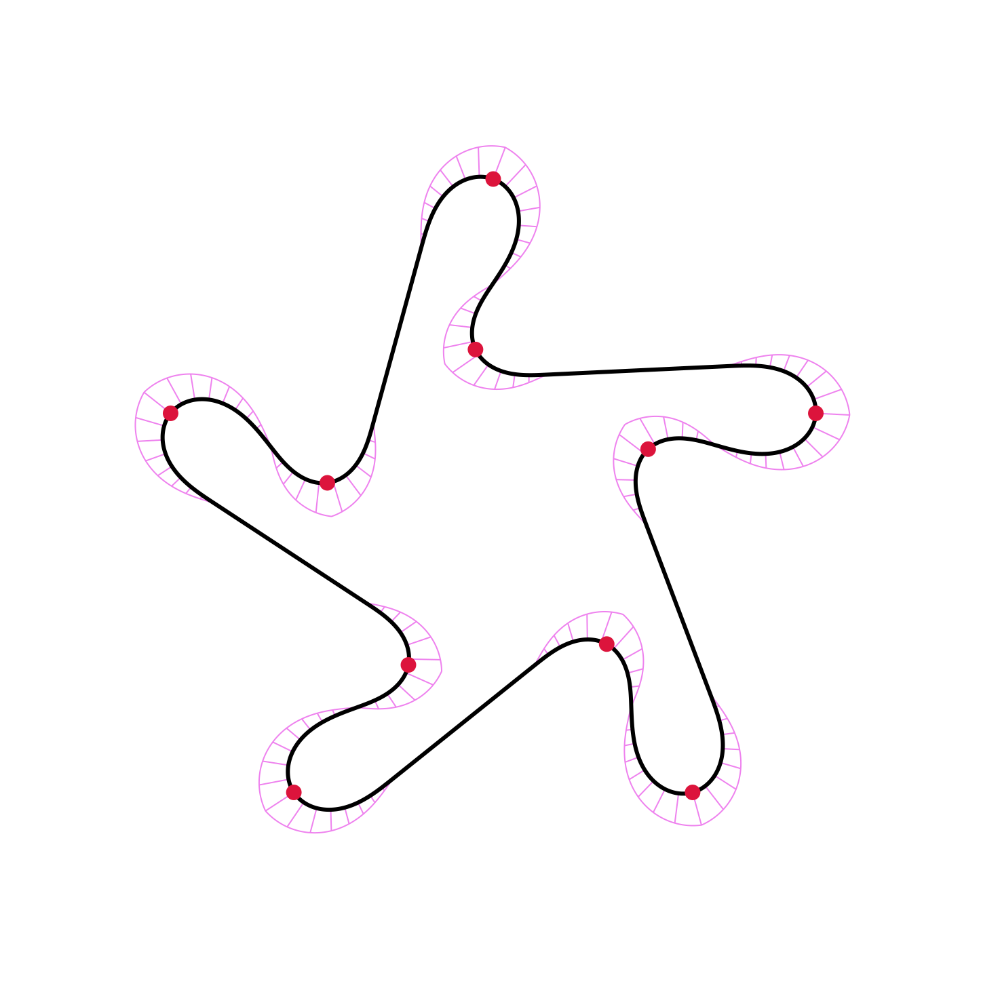

<!---
{}
Click the *Cite* button above to demo the feature to enable visitors to import publication metadata into their reference management software.
{}

{}
Create your slides in Markdown - click the *Slides* button to check out the example.
{}

Supplementary notes can be added here, including [code, math, and images](https://wowchemy.com/docs/writing-markdown-latex/).
--->

## Talk

<iframe width="600" height="400"
src="https://youtube.com/embed/t0I-pWYvDS8?t=11989">
</iframe>

 

##### Comparison table

|       |        |   |   |
| :---:        |    :----:   |          :---: |         :---: |
| [Trigonometric Blending](https://dl.acm.org/doi/10.1145/3400301)      | [$\kappa$-curves](https://dl.acm.org/doi/10.1145/3072959.3073692) | 3-arcs clothoid     | clothoid-line-clothoid     |

(Open images in a new tab to display the .svg properly)
